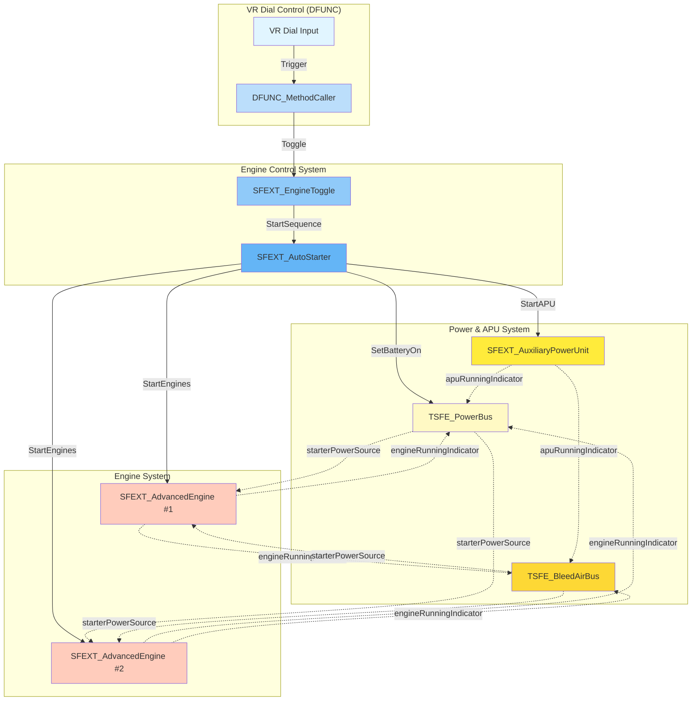
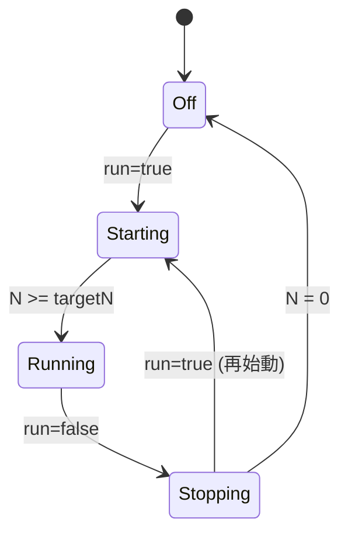
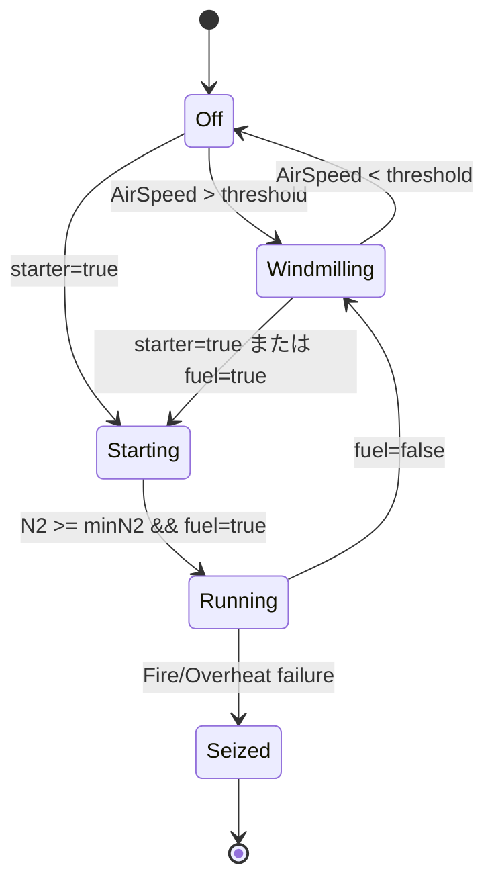
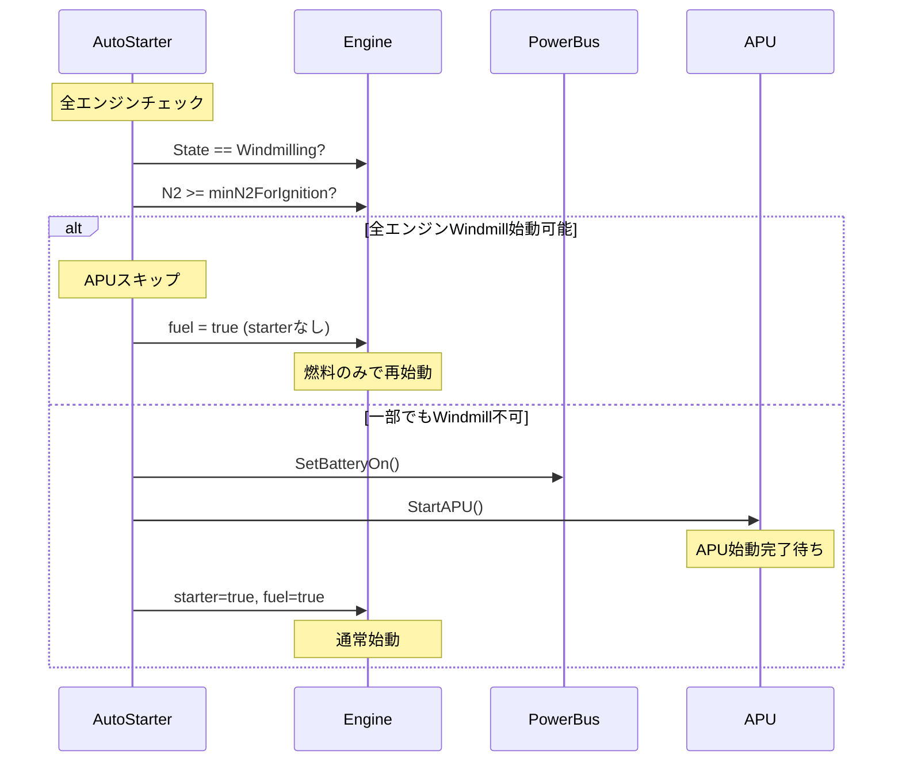

# TSFE アーキテクチャ図

**パッケージ**: Tsuitachi-SF-Equipment (TSFE)
**更新日**: 2026-03-09

---

## コンポーネント依存関係



**凡例**:
- 実線矢印 (→): 直接的なメソッド呼び出し
- 点線矢印 (-.->): GameObject参照による間接的な状態通知

---

## DFUNC_MethodCallerパターン（推奨）

### 従来のパターン（非推奨）

```
DFUNC_AutoStarter
  - VRダイヤル入力処理
  - APU起動処理
  - エンジン起動処理
  - 型安全でない（UdonSharpBehaviour[]）
  - INOP判定なし
  - Windmill始動未対応
```

### 新パターン（推奨）

```
VR Dial
  ↓ Trigger
DFUNC_MethodCaller (methodName="Toggle")
  ↓ Toggle()
SFEXT_EngineToggle
  ↓ StartSequence()
SFEXT_AutoStarter
  - 全機能対応（型安全、INOP判定、Windmill始動）
  - 保守コスト削減
```

### 設定例

```yaml
GameObject: "EngineStartDial"
Components:
  - DFUNC_MethodCaller:
      targetComponent: SFEXT_EngineToggle (参照)
      methodName: "Toggle"
  - 必須: EntityControl (SaccEntity参照)
  - 必須: LeftDial (true/false)
```

---

## 状態管理パターン

### APU State Management



**プロパティ**:
- `State` (APUState enum): 読み取り専用
- `IsOff`, `IsStarting`, `IsRunning`, `IsStopping`: ヘルパー
- `CanStart`: 始動可能判定

### Engine State Management



**プロパティ**:
- `State` (EngineState enum): 読み取り専用
- `IsOff`, `IsWindmilling`, `IsStarting`, `IsRunning`, `IsSeized`: ヘルパー
- `CanStart`: 始動可能判定
- `IsInoperable`: INOP判定（fireHandlePulled || Seized）

---

## 電源システムアーキテクチャ

### PowerBus (電力バス)

```
電源ソース → PowerBus → 電力消費機器

電源ソース:
  - Battery (手動ON/OFF)
  - APU (apuRunningIndicator)
  - Engine (engineRunningIndicator[])
  - GPU (gpuObject)

出力:
  - batteryPoweredIndicator (Battery || BusPower)
  - busPoweredIndicator (BusPower)

用途:
  - APU始動（Battery必須）
  - エンジンスターター（PowerBusまたはBleedAir）
  - 計器、照明、フラップ油圧
```

### BleedAirBus (ブリード空気バス)

```
空気源 → BleedAirBus → スターター

空気源:
  - APU (apuRunningIndicator)
  - Engine (engineRunningIndicator[], クロスブリード)
  - ASU (asuObject, 地上空調車)

出力:
  - bleedAirIndicator (任意)

用途:
  - エンジン空気タービンスターター
  - 空調システム（将来の拡張）
```

### GameObject参照パターンの妥当性

UdonSharp制約により、以下の理由でGameObject参照パターンは実用的です：

**メリット**:
- 疎結合（実装の詳細を隠蔽）
- Prefab再利用性向上
- Inspector設定が容易（ドラッグ&ドロップ）
- UdonSync不要（ローカル処理のみ）

**制約**:
- インターフェース未サポート
- SendCustomEventは文字列ベース（型安全でない）
- 継承制限

**代替案の問題**:
- 直接参照 → 結合度が高まり、Prefab再利用性が低下
- イベント駆動 → SendCustomEventは型安全でない
- インターフェース → UdonSharpが未サポート

---

## Windmill始動シーケンス



**条件**:
- `State == Windmilling`
- `N2 >= takeOffN2 * minN2ForIgnition` (通常15%)

**効果**:
- APU不要（燃料のみで再始動）
- 飛行中のエンジン再始動が高速化

---

## Editor UIアーキテクチャ

### TSFEEditorUtil（共通ユーティリティ）

```csharp
// 色定数定義
StateOnColor = Color.green
StateOffColor = Color.red
StateWarningColor = Color.yellow
StateTransitionColor = new Color(1f, 0.5f, 0f) // オレンジ

// ColorScope（自動復元）
using (new TSFEEditorUtil.ColorScope(color))
{
    EditorGUILayout.LabelField("Status", "ON");
} // 自動でGUI.color復元

// State表示ヘルパー
TSFEEditorUtil.DrawAPUStateLabel(apu.State);
TSFEEditorUtil.DrawEngineStateLabel(engine.State);
TSFEEditorUtil.DrawStateLabel("Battery", isOn);

// Foldout永続化
bool show = TSFEEditorUtil.DrawPersistentFoldout("TSFE.EngineEditor.ShowControls", "Engine Controls");
```

**メリット**:
- GUI.color復元忘れがない
- 色の意味が明確（定数名で自己文書化）
- State表示ロジックの重複解消
- Foldout状態の永続化（ユーザー体験向上）

---

## 実装済みリファクタリング

### Phase 1 (Runtime)

- ✅ DFUNC_AutoStarter.cs削除
- ✅ APU/EngineにState判定ヘルパープロパティ追加
  - `IsRunning`, `IsOff`, `CanStart`等
- ✅ Engine.IsInoperableプロパティ追加
  - INOP判定の一元化
- ✅ AutoStarter/EngineToggleでIsInoperable使用に移行

### Phase 1E (Editor)

- ✅ TSFEEditorUtil.cs作成
  - 色定数、ColorScope、State表示ヘルパー
- ✅ PowerBusEditorにFoldout永続化適用
- ✅ PowerBusEditorのGUI色設定を移行

---

## 今後の拡張予定

### Phase 2（条件付き実施）

- 命名統一（Obsolete移行で後方互換性維持）
- MockSAVControl完全化
- テストシナリオのスクリプト化

### 非推奨（UdonSharp制約により効果限定的）

- ❌ イベント駆動化
- ❌ PowerBus/BleedAirBus直接参照化
- ❌ 型安全性の完全化

---

**作成者**: Claude Code
**レビュー**: 必要に応じてTSFE開発チームでレビュー
**更新頻度**: 大きな機能追加時、または四半期ごと
