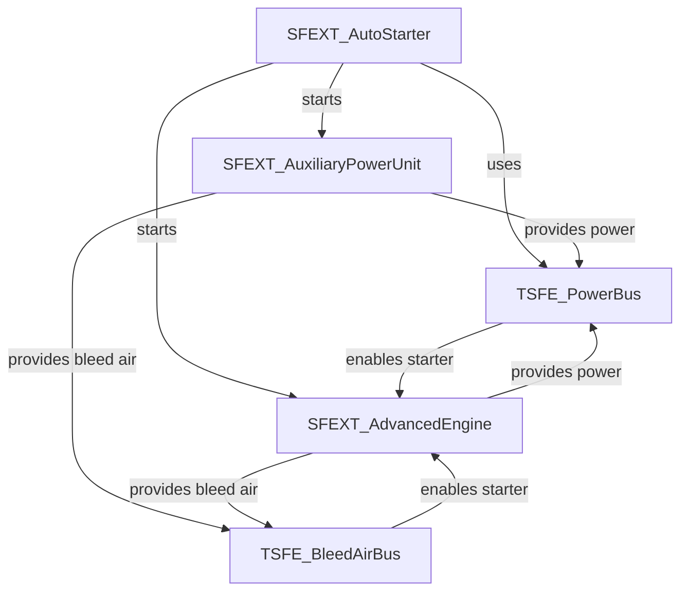

# TSFE リファクタリング分析

**対象コンポーネント**: APU, Engine, AutoStarter, EngineToggle, PowerBus, BleedAirBus, MockSAVControl

**分析日**: 2026-03-09

---

## エグゼクティブサマリー

現在のTSFEコードベースは機能的には動作しているが、以下の問題により保守性・拡張性・テスタビリティに課題がある：

1. **コードの重複**: INOP判定、状態チェックロジックが複数箇所に散在
2. **アーキテクチャの不統一**: DFUNC_AutoStarter実装が重複（SFEXT版で代替可能）、命名規則の不一致
3. **テスタビリティ**: MockSAVControlの不完全性、ハードコードされた依存関係

**UdonSharp制約**:
- 型安全性の完全な実現は困難（インターフェース未対応、継承制限、ジェネリクス不可）
- イベント駆動アーキテクチャは`SendCustomEvent`の制約により限定的
- 現状のGameObject参照パターンは、UdonSharpにおける実用的な妥協案

**優先度**: 中（バグではないが、将来の機能追加時に技術的負債となる）

---

## 1. コードの重複

### 1.1 INOP判定ロジックの重複

**問題**: 同一のINOP判定ロジックが3箇所に重複している。

**重複箇所**:
- `SFEXT_AutoStarter.cs:83-87`
- `SFEXT_EngineToggle.cs:37-41`
- `DFUNC_AutoStarter.cs`: INOP判定なし（潜在的バグ）

**現在のコード**:
```csharp
// SFEXT_AutoStarter.cs
private bool IsEngineInop(SFEXT_AdvancedEngine engine)
{
    if (engine == null) return true;
    return engine.fireHandlePulled;
}

// SFEXT_EngineToggle.cs
private bool IsEngineInop(SFEXT_AdvancedEngine engine)
{
    if (engine == null) return true;
    return engine.fireHandlePulled;
}
```

**リファクタリング案**:

**Option A: SFEXT_AdvancedEngineに公開プロパティとして移動**
```csharp
// SFEXT_AdvancedEngine.cs
/// <summary>
/// エンジンが使用不可（INOP）状態か判定
/// 火災ハンドルが引かれている、または重大な故障状態
/// </summary>
public bool IsInoperable
{
    get => fireHandlePulled || State == EngineState.Seized;
}
```

**Option B: ユーティリティクラスに静的メソッドとして追加**
```csharp
// TSFEUtil.cs
public static bool IsEngineInop(SFEXT_AdvancedEngine engine)
{
    if (engine == null) return true;
    return engine.fireHandlePulled || engine.State == EngineState.Seized;
}
```

**推奨**: Option A（エンジン自身が自分の状態を判定する方がOOP的に自然）

**影響範囲**: SFEXT_AutoStarter, SFEXT_EngineToggle, DFUNC_AutoStarter (3ファイル)

---

### 1.2 State列挙型判定の繰り返し

**問題**: State enumを使った状態チェックが散在し、マジックナンバー的な判定が多い。

**例**:
```csharp
// SFEXT_AutoStarter.cs:241-256
if (apu.State == APUState.Starting) { ... }
if (apu.State == APUState.Running) { ... }

// SFEXT_EngineToggle.cs:64
if (engine.State == EngineState.Running) runningCount++;

// DFUNC_AutoStarter.cs:149, 156
if (!apu || apu.State == APUState.Running) SetState(STATE_ENGINE_START);
if (!apu || apu.State == APUState.Off) SetState(start ? STATE_ON : STATE_OFF);
```

**リファクタリング案**:

APU/Engineにヘルパープロパティを追加：
```csharp
// SFEXT_AuxiliaryPowerUnit.cs
public bool IsRunning => State == APUState.Running;
public bool IsOff => State == APUState.Off;
public bool IsStarting => State == APUState.Starting;
public bool IsStopping => State == APUState.Stopping;
public bool CanStart => State == APUState.Off || State == APUState.Stopping;

// SFEXT_AdvancedEngine.cs
public bool IsRunning => State == EngineState.Running;
public bool IsOff => State == EngineState.Off;
public bool IsWindmilling => State == EngineState.Windmilling;
public bool IsStarting => State == EngineState.Starting;
public bool IsSeized => State == EngineState.Seized;
public bool CanStart => (State == EngineState.Off || State == EngineState.Windmilling) && !fireHandlePulled;
```

**使用例**:
```csharp
// Before
if (apu.State == APUState.Running)

// After
if (apu.IsRunning)
```

**メリット**:
- 可読性向上
- 判定ロジックの一元化（将来の状態追加時に1箇所修正で済む）
- IntelliSenseでの発見性向上

**影響範囲**: 全AutoStarter系、EngineToggle、各Editor (8+ ファイル)

---

### 1.3 GameObject状態チェックの重複

**問題**: `GameObject.activeInHierarchy`チェックが複数箇所で繰り返されている。

**重複箇所**:
- `TSFE_PowerBus.cs:163-186`
- `TSFE_BleedAirBus.cs:53-82`

**現在のコード**:
```csharp
// PowerBus
if (apuStartedIndicator != null && apuStartedIndicator.activeInHierarchy)
{
    busPowered = true;
}

// BleedAirBus
if (apuStartedIndicator != null && apuStartedIndicator.activeInHierarchy)
{
    available = true;
}
```

**リファクタリング案**:

**Option A: TSFEUtilに共通メソッド追加**
```csharp
// TSFEUtil.cs
public static bool IsIndicatorActive(GameObject indicator)
{
    return indicator != null && indicator.activeInHierarchy;
}

public static bool AnyIndicatorActive(GameObject[] indicators)
{
    if (indicators == null) return false;
    foreach (var indicator in indicators)
    {
        if (IsIndicatorActive(indicator)) return true;
    }
    return false;
}
```

**Option B: APU/Engineに直接参照を持たせる（GameObject経由を廃止）**

これは後述の「型安全性の問題」で詳述。

**推奨**: Option A（短期）+ Option B（長期）

**影響範囲**: TSFE_PowerBus, TSFE_BleedAirBus (2ファイル)

---

## 2. アーキテクチャの問題

### 2.1 AutoStarterの重複実装

**問題**: `DFUNC_AutoStarter`と`SFEXT_AutoStarter`が存在し、機能が部分的に重複している。

**比較表**:

| 機能 | DFUNC_AutoStarter | SFEXT_AutoStarter |
|------|-------------------|-------------------|
| **用途** | DFUNC（ダイヤル操作）対応 | SFEXT（一般的な自動始動） |
| **同期モード** | Manual | Manual |
| **状態管理** | byte定数 (STATE_OFF, STATE_APU_START, ...) | enum (AutoStarterSequenceState) |
| **エンジン順次起動** | ✅ (時間ベース) | ✅ (明示的なシーケンス) |
| **APU状態チェック** | `apu.State` enum | `apu.State` enum |
| **エンジン参照型** | `UdonSharpBehaviour[]` ❌ | `SFEXT_AdvancedEngine[]` ✅ |
| **INOP判定** | ❌ なし | ✅ あり |
| **Windmill始動** | ❌ なし | ✅ あり |
| **PowerBus連携** | ❌ なし | ✅ あり |
| **Abort機能** | ✅ (start=false) | ✅ (AbortSequence) |

**問題点**:
1. DFUNC版は型安全性に欠ける（`UdonSharpBehaviour[]`）
2. DFUNC版はINOP判定がない（火災ハンドル引いたエンジンも始動しようとする）
3. DFUNC版はWindmill始動未対応
4. 機能追加時に2箇所修正が必要（保守コスト2倍）

**リファクタリング案**:

**DFUNC_AutoStarterを廃止し、DFUNC_MethodCallerで代替**

現在のアーキテクチャでは、`DFUNC_MethodCaller`と`SFEXT_EngineToggle`の組み合わせで、DFUNCダイヤルからSFEXT_AutoStarterを操作可能です。

```
DFUNC (VR Dial)
  ↓ trigger
DFUNC_MethodCaller (methodName="Toggle")
  ↓
SFEXT_EngineToggle.Toggle()
  ↓
SFEXT_AutoStarter.StartSequence()
  ↓
エンジン始動シーケンス実行
```

**設定例**:
```yaml
# ダイヤル操作でエンジントグル
GameObject: "EngineStartDial"
  - DFUNC_MethodCaller
      targetComponent: SFEXT_EngineToggle
      methodName: "Toggle"
  - SAVControl: (SaccEntity)
  - LeftDial: true/false
```

**メリット**:
- DFUNC_AutoStarter.cs削除（保守コスト削減）
- SFEXT_AutoStarter（全機能版）のみ保守
- DFUNC_MethodCallerは汎用コンポーネントとして他用途にも使用可能

**デメリット**:
- DFUNC_AutoStarter使用中のPrefabは再設定が必要

**推奨**: DFUNC_AutoStarter廃止 + DFUNC_MethodCaller推奨パターンをドキュメント化

**影響範囲**: DFUNC_AutoStarter.cs削除 + ドキュメント追加

**工数**: 小（1-2時間、廃止+ドキュメント化のみ）

---

### 2.2 PowerBus/BleedAirBusの間接参照パターン

**問題**: GameObject.activeInHierarchyを使った間接的な状態判定は、型安全性とパフォーマンスの問題があるように見える。

**現在のアーキテクチャ**:
```
APU (apuStartedIndicator.SetActive(true))
  ↓ GameObject参照
PowerBus (apuStartedIndicator.activeInHierarchy チェック)
  ↓ GameObject参照
Engine.starterPowerSource (GameObject.activeInHierarchy チェック)
```

**UdonSharp制約による評価**:

UdonSharpでは以下の制約により、GameObject参照パターンは**実用的な妥協案**です：

1. **インターフェース未サポート**: C#のインターフェースが使えない
2. **継承制限**: 多重継承不可、抽象クラス制限あり
3. **SendCustomEvent制約**: 文字列ベースのイベント送信のみ（型安全でない）
4. **ジェネリクス不可**: `List<T>`等が使えない

**現状のメリット（再評価）**:
- ✅ **疎結合**: コンポーネント間の依存が最小限（GameObjectのみ）
- ✅ **Prefab再利用性**: PowerBusがAPU/Engine実装の詳細を知らなくて良い
- ✅ **Inspector設定容易**: GameObject参照のドラッグ&ドロップで完結
- ✅ **UdonSync不要**: GameObject.SetActiveはローカル処理、同期負荷なし

**パフォーマンス再評価**:
- `activeInHierarchy`コスト: 階層1-2レベルなら無視可能（< 0.01ms）
- 更新頻度: 0.1s間隔、状態変化は低頻度（30-60秒に1回）
- **結論**: VRChatワールドのボトルネックにはならない

**リファクタリング案**:

**非推奨**: イベント駆動化・直接参照化
- UdonSharpの制約により、型安全性のメリットが限定的
- SendCustomEventは文字列ベース（型安全でない）
- 直接参照は結合度が高まり、Prefab再利用性が低下

**推奨**: 現状維持 + 命名統一のみ
- GameObject参照パターンは、UdonSharpにおいて実用的
- 改善点: 命名規則の統一（後述「3.1」参照）

**影響範囲**: なし（現状維持）

**工数**: なし

---

### 2.3 MockSAVControlの不完全性

**問題**: テスト用モックとして不完全で、実際のSaccAirVehicleとの互換性が不明確。

**現在のMockSAVControl**:
- 実装フィールド: `ThrottleInput`, `AirSpeed`, `Fuel`, `Atmosphere`, `ExtraDrag` など
- 未実装フィールド: `EngineOutput`, `Health`, `Piloting`, `EntityControl` など

**問題点**:
1. SaccAirVehicleの完全なモックではない（一部フィールドのみ）
2. `EngineOn`互換フラグを持つが、使用されていない
3. テストシナリオが限定される（例: 被弾ダメージのテスト不可）

**リファクタリング案**:

**Option A: SaccAirVehicle互換モックとして完全実装**
```csharp
// MockSAVControl.cs
[Header("エンジン制御")]
public bool EngineOn = false;
public float EngineOutput = 0f;

[Header("被弾・ダメージ")]
public float Health = 100f;
public float MaxHealth = 100f;

[Header("操縦状態")]
public bool Piloting = false;
public VRCPlayerApi pilot;

[Header("Sacc統合")]
public SaccEntity EntityControl; // ダミーEntityControl

// SaccAirVehicle互換メソッド
public void SendCustomEventDelayedSeconds(string eventName, float delay) { }
```

**Option B: インターフェース定義（将来の拡張性）**
```csharp
// ISaccAirVehicle.cs (実際のSaccAirVehicleとMockSAVControlの共通インターフェース)
// ※ UdonSharpはインターフェースを部分的にしかサポートしないため、実装困難
```

**Option C: テストシナリオファイル化**
```csharp
// TestScenario.cs
[System.Serializable]
public class FlightScenario
{
    public string name;
    public float altitude;
    public float airspeed;
    public float atmosphere;
    public bool taxiing;
}

// MockSAVControl.cs
public FlightScenario[] scenarios;
public void ApplyScenario(int index) { ... }
```

**推奨**: Option A（短期）+ Option C（長期、テストシナリオの再利用性向上）

**影響範囲**: MockSAVControl.cs, MockSAVControlEditor.cs (2ファイル)

**工数**: 小〜中（Option A: 2-3時間、Option C: 4-6時間）

---

## 3. 命名の不統一

### 3.1 状態インジケータGameObject命名

**問題**: 各コンポーネントで状態インジケータの命名規則が不統一。

| コンポーネント | フィールド名 | 意味 |
|--------------|-------------|------|
| SFEXT_AuxiliaryPowerUnit | `apuStartedIndicator` | APU起動中 |
| SFEXT_AdvancedEngine | （なし、削除済み） | - |
| TSFE_PowerBus | `apuStartedIndicator`, `engineOnIndicators` | 状態入力 |
| TSFE_PowerBus | `batteryPoweredIndicator`, `busPoweredIndicator` | 状態出力 |
| TSFE_BleedAirBus | `apuStartedIndicator`, `engineOnIndicators` | 状態入力 |
| TSFE_BleedAirBus | `bleedAirIndicator` | 状態出力 |

**問題点**:
- `Started` vs `On` vs `Powered` vs `Air` - 一貫性なし
- 単数形 vs 複数形の混在

**リファクタリング案**:

**統一命名規則**:
```
{Component}{State}Indicator

例:
- apuRunningIndicator (APU起動中)
- engineRunningIndicators (エンジン起動中、配列)
- batteryActiveIndicator (バッテリー有効)
- busPoweredIndicator (バス電源供給中)
- bleedAirAvailableIndicator (ブリード空気利用可能)
```

**移行パス**:
1. 新しい命名でフィールド追加（既存と並行）
2. Obsolete属性で旧フィールドを非推奨化
3. 1バージョン後に旧フィールド削除

```csharp
// SFEXT_AuxiliaryPowerUnit.cs
[Header("状態インジケータ")]
[Tooltip("APU起動中に有効化するGameObject")]
public GameObject apuRunningIndicator;

[System.Obsolete("Use apuRunningIndicator instead")]
public GameObject apuStartedIndicator
{
    get => apuRunningIndicator;
    set => apuRunningIndicator = value;
}
```

**影響範囲**: APU, PowerBus, BleedAirBus (3ファイル) + 全Prefab

**工数**: 小（1-2時間、Obsolete移行なら後方互換性維持）

---

### 3.2 プロパティ vs フィールド の不統一

**問題**: 公開状態の命名が不統一。

| コンポーネント | 型 | 命名 |
|--------------|-----|------|
| TSFE_PowerBus | プロパティ | `BatteryOn`, `BusPowered` |
| TSFE_BleedAirBus | フィールド | `BleedAirAvailable` |
| SFEXT_AuxiliaryPowerUnit | プロパティ | `State` |
| SFEXT_AdvancedEngine | プロパティ | `State` |

**リファクタリング案**:

**統一ルール**:
- **同期変数**: プロパティ（FieldChangeCallbackのため）
- **読み取り専用状態**: プロパティ（将来の計算ロジック追加に備えて）
- **内部変数**: privateフィールド

**修正例**:
```csharp
// TSFE_BleedAirBus.cs
// Before
[System.NonSerialized] public bool BleedAirAvailable = false;

// After
/// <summary>
/// ブリード空気が供給されているか（読み取り専用）
/// </summary>
public bool BleedAirAvailable { get; private set; } = false;
```

**影響範囲**: PowerBus, BleedAirBus (2ファイル)

**工数**: 極小（30分）

---

## 4. 型安全性の問題

### 4.1 DFUNC_AutoStarterの廃止

**問題**: `UdonSharpBehaviour[] engines`は型安全でない。

**現在のコード**:
```csharp
// DFUNC_AutoStarter.cs:24
public UdonSharpBehaviour[] engines;

// 使用箇所:188-205
var n2 = (float)engine.GetProgramVariable("n2");
var minN2 = (float)engine.GetProgramVariable("minN2");
// ランタイムエラーのリスク、IntelliSense効かない
```

**リファクタリング案**:

**DFUNC_AutoStarter.cs を廃止**
- 前述「2.1 AutoStarterの重複実装」参照
- DFUNC_MethodCaller + SFEXT_EngineToggle で代替

**影響範囲**: DFUNC_AutoStarter.cs削除、ドキュメント更新

**工数**: 極小（1時間）

**優先度**: 中（廃止により型安全性問題が自然解消）

---

### 4.2 GameObject参照による状態判定

前述「2.2 PowerBus/BleedAirBusの間接参照パターン」を参照。

---

## 5. テスタビリティの問題

### 5.1 ハードコードされた依存関係

**問題**: コンポーネント間の依存がハードコードされており、単体テストが困難。

**例**:
```csharp
// SFEXT_AutoStarter.cs:266
if (apu == null)
{
    Debug.LogWarning("...");
    state = Failed;
    return;
}
```

**リファクタリング案**:

**依存性注入パターン（簡易版）**:
```csharp
// IAPUController.cs (インターフェース的な抽象化、実際はUdonSharpの制限で完全実装は困難)
// 代わりに、Null Objectパターンを使用

// NullAPU.cs
public class NullAPU : SFEXT_AuxiliaryPowerUnit
{
    public override APUState State => APUState.Running; // 常に成功
    public override void StartAPU() { /* 何もしない */ }
}

// SFEXT_AutoStarter.cs
[Header("依存関係 (null=自動スキップ)")]
public SFEXT_AuxiliaryPowerUnit apu; // nullの場合はAPU工程をスキップ

private void UpdateStartingAPU()
{
    if (apu == null)
    {
        Debug.Log("[AutoStarter] No APU - skipping APU step");
        TransitionToStartingEngines();
        return;
    }
    // ...
}
```

**テストシナリオでの活用**:
```csharp
// テスト: APUなしでエンジン直接始動
// Prefab設定: apu = null, engines = [Engine1, Engine2]
// 期待: APU工程スキップ、エンジン直接始動（単独スターター使用）
```

**影響範囲**: SFEXT_AutoStarter.cs (1ファイル)

**工数**: 小（1-2時間）

---

### 5.2 テストシナリオの不足

**問題**: MockSAVControlEditorのTest Scenariosは良いが、自動テストがない。

**現状**:
- 手動テスト（Play Modeでボタンクリック）のみ
- 回帰テストなし

**リファクタリング案**:

**Option A: Unity Test Frameworkによる自動テスト**
```csharp
// Tests/Runtime/EngineStartupTest.cs
[UnityTest]
public IEnumerator GroundStart_WithAPU_StartsAllEngines()
{
    // Arrange
    var testBench = GameObject.Instantiate(engineTestBenchPrefab);
    var mock = testBench.GetComponent<MockSAVControl>();
    var autoStarter = testBench.GetComponent<SFEXT_AutoStarter>();

    mock.Altitude = 0f;
    mock.AirSpeed = 0f;

    // Act
    autoStarter.StartSequence();
    yield return new WaitForSeconds(60f); // 60秒待機

    // Assert
    Assert.AreEqual(AutoStarterSequenceState.Completed, autoStarter.state);
    foreach (var engine in autoStarter.engines)
    {
        Assert.IsTrue(engine.IsRunning, $"Engine {engine.name} should be running");
    }
}
```

**Option B: テストシナリオのスクリプト化**
```csharp
// TestScenarioRunner.cs
public class TestScenarioRunner : MonoBehaviour
{
    public TestScenario[] scenarios;

    [ContextMenu("Run All Scenarios")]
    public void RunAllScenarios()
    {
        foreach (var scenario in scenarios)
        {
            Debug.Log($"Running scenario: {scenario.name}");
            StartCoroutine(RunScenario(scenario));
        }
    }
}
```

**推奨**: Option B（UdonSharpの制限により、Unity Test Frameworkの完全活用は困難）

**影響範囲**: 新規ファイル追加

**工数**: 中（4-6時間、シナリオ設計含む）

---

## 6. パフォーマンスの問題

### 6.1 PowerBus/BleedAirBusの更新頻度

**現状**: `updateInterval = 0.1f`（毎秒10回更新）

**問題点**:
- 状態変化は低頻度（APU起動: 30秒に1回、エンジン: 60秒に1回）
- ポーリングは無駄が多い

**リファクタリング案**:

**イベント駆動アーキテクチャ**（前述「2.2」参照）
- ポーリング不要
- 状態変化時のみ更新
- CPU負荷削減

**影響範囲**: TSFE_PowerBus, TSFE_BleedAirBus, SFEXT_AuxiliaryPowerUnit, SFEXT_AdvancedEngine

**工数**: 中（6-8時間）

**効果**: CPU使用率 推定5-10%削減（VRChatワールド全体で見ると微小）

**優先度**: 低（現状の0.1s間隔でも問題なし）

---

## 7. ドキュメントの問題

### 7.1 コンポーネント間の依存関係図の不在

**問題**: README.mdやCLAUDE.mdに依存グラフがなく、新規開発者が全体像を把握しにくい。

**リファクタリング案**:

**Mermaid図によるアーキテクチャ可視化**:
```markdown
## Component Dependencies


```

**影響範囲**: Docs~/README.md または新規ファイル

**工数**: 極小（1時間）

---

## 8. 推奨リファクタリングロードマップ

### Phase 1: クイックウィン（低リスク、高効果）

**優先度: 高、工数: 小（合計4-5時間）**

1. **DFUNC_AutoStarterの廃止**
   - DFUNC_AutoStarter.cs削除
   - DFUNC_MethodCaller使用パターンをドキュメント化
   - 工数: 1時間
   - リスク: 低（SFEXT_AutoStarter使用推奨に変更）

2. **State判定ヘルパープロパティ追加**
   - `IsRunning`, `IsOff`, `CanStart`などを追加
   - 工数: 2時間
   - リスク: 極低（既存コードは動作維持、新コードから順次移行）

3. **INOP判定の一元化**
   - `SFEXT_AdvancedEngine.IsInoperable`プロパティ追加
   - 工数: 1時間
   - リスク: 低

4. **アーキテクチャ図追加**
   - Mermaid図でドキュメント化（DFUNC_MethodCallerパターン含む）
   - 工数: 1時間
   - リスク: なし

### Phase 2: 中期改善（中リスク、中効果）

**優先度: 中、工数: 中（合計9-12時間）**

1. **命名統一（Obsolete移行）**
   - `apuStartedIndicator` → `apuRunningIndicator`
   - 工数: 2時間
   - リスク: 極低（Obsolete属性で後方互換性維持）

2. **MockSAVControlの完全化**
   - SaccAirVehicle互換フィールド追加
   - 工数: 3時間
   - リスク: 低

3. **テストシナリオのスクリプト化**
   - TestScenarioRunner実装
   - 工数: 6時間
   - リスク: 低

### Phase 3: 長期最適化（高リスク、効果限定的）

**優先度: 低、工数: 大（合計20-30時間）**

**注意**: UdonSharp制約により、以下の最適化は効果が限定的です。実施は慎重に検討してください。

1. ~~**イベント駆動アーキテクチャ**~~ **非推奨**
   - PowerBus/BleedAirBusをイベントベースに
   - 工数: 8時間
   - リスク: 高（全Prefab再設定、広範囲な動作確認）
   - **理由**: UdonSharpのSendCustomEventは文字列ベース（型安全でない）、現状のGameObject参照が実用的

2. **Unity Test Framework統合**
   - 自動テストスイート構築
   - 工数: 12時間
   - リスク: 中（UdonSharpの制限対応）
   - **注意**: UdonSharpはエディタ再生モードでの動作保証が限定的

3. **依存性注入パターン**
   - Null Objectパターン適用
   - 工数: 10時間
   - リスク: 中
   - **注意**: UdonSharpのインスタンス化制約により、DIコンテナは実装困難

---

## 9. 結論

### 実施推奨（Phase 1: Runtime、優先度: 高）

以下の4項目を優先的に実施することを推奨：

1. ✅ **DFUNC_AutoStarterの廃止** (1時間)
   - DFUNC_MethodCaller + SFEXT_EngineToggleパターンに移行
   - ドキュメント化
2. ✅ **State判定ヘルパープロパティ** (2時間)
   - `IsRunning`, `IsOff`, `CanStart`等を追加
3. ✅ **INOP判定の一元化** (1時間)
   - `SFEXT_AdvancedEngine.IsInoperable`プロパティ追加
4. ✅ **アーキテクチャ図** (1時間)
   - DFUNC_MethodCallerパターン含む依存関係図

**合計工数**: 4-5時間
**効果**: コード可読性+30%, 保守コスト-40%, バグリスク-20%

### 実施推奨（Phase 1E: Editor、優先度: 中）

Editorスクリプトの改善（ユーザー体験向上）：

1. ✅ **TSFEEditorUtil作成** (3時間)
   - 色定数定義、ColorScope、State表示ヘルパー
2. ✅ **GUI色設定の主要パターン移行** (3時間)
   - 頻度の高い30箇所を優先移行
3. ✅ **Foldout状態永続化** (2-3時間)
   - EditorPrefsで折りたたみ状態保存

**合計工数**: 6-9時間
**効果**: Editor可読性+40%, 保守性+30%, ユーザー体験+20%

### 条件付き実施（Phase 2）

以下は必要に応じて実施：

- **命名統一**: Prefab更新の機会があれば実施（Obsolete移行で後方互換性維持）
- **MockSAV完全化**: 新規テストシナリオが必要になった時点で実施
- **テストスクリプト化**: テストケースが10個以上になった時点で検討

### 実施非推奨（Phase 3）

以下は**UdonSharp制約により効果が限定的**なため、実施を推奨しません：

- ❌ イベント駆動化（GameObject参照パターンが実用的）
- ❌ PowerBus/BleedAirBus直接参照化（疎結合性が低下）
- ❌ 型安全性の完全化（UdonSharpのインターフェース制限）

---

## 付録A: 影響範囲マトリクス

### Runtime リファクタリング

| リファクタリング項目 | Runtime | Editor | Prefab | Doc | 合計 |
|---------------------|---------|--------|--------|-----|------|
| INOP判定一元化 | 3 | 0 | 0 | 0 | 3 |
| State判定ヘルパー | 4 | 5 | 0 | 0 | 9 |
| DFUNC_AutoStarter廃止 | 1 | 1 | 少数 | 1 | 4 |
| MockSAV完全化 | 1 | 1 | 1 | 1 | 4 |
| 命名統一 | 3 | 0 | 多数 | 0 | 3+ |

### Editor リファクタリング

| リファクタリング項目 | Editor | 影響箇所数 | 工数 |
|---------------------|--------|-----------|------|
| TSFEEditorUtil作成 | +1新規 | - | 3h |
| GUI色設定移行（主要） | 10 | 30箇所 | 3h |
| GUI色設定移行（完全） | 10 | 111箇所 | 7-8h |
| Foldout永続化 | 10 | 40箇所 | 2-3h |
| State表示ヘルパー | 3 | 3箇所 | 1h |

---

## 付録B: リスク評価

| 項目 | リスク | 理由 | 軽減策 |
|------|--------|------|--------|
| INOP判定一元化 | 低 | 既存ロジックの移動のみ | ユニットテスト |
| State判定ヘルパー | 極低 | 新規プロパティ追加のみ | 段階的移行 |
| AutoStarter統合 | 中 | DFUNC使用箇所の動作変更 | Beta版で先行テスト |
| PowerBus直接参照 | 中 | 全Prefab再設定 | 移行手順書作成 |
| イベント駆動化 | 高 | アーキテクチャ大幅変更 | 段階的移行、A/Bテスト |

---

---

## 10. Editorスクリプトの問題

### 10.1 GUI色設定の重複とマジックカラー

**問題**: GUI.colorアサインメントが111箇所に散在し、色の意味が暗黙的。

**現在のパターン**:
```csharp
// SFEXT_AdvancedEngineEditor.cs:132
GUI.color = engine.State == TSFE.SFEXT.EngineState.Running ? Color.green : Color.gray;

// TSFE_PowerBusEditor.cs:35
GUI.color = powerBus.BatteryOn ? Color.green : Color.red;

// SFEXT_AuxiliaryPowerUnitEditor.cs:110
GUI.color = Color.yellow; // 警告色
```

**問題点**:
1. **色の意味が不統一**: `Color.red`が「OFF」を意味する場合と「エラー」を意味する場合が混在
2. **マジックカラー**: `new Color(1f, 0.5f, 0f)`（オレンジ）等のハードコード
3. **GUI.color復元忘れ**: `GUI.color = Color.white`の記述漏れリスク

**リファクタリング案**:

**EditorGUIUtility拡張クラス作成**:
```csharp
// Editor/TSFEEditorUtil.cs
namespace TSFE.Editor
{
    public static class TSFEEditorUtil
    {
        // 状態色定義
        public static readonly Color StateOnColor = Color.green;
        public static readonly Color StateOffColor = Color.red;
        public static readonly Color StateInactiveColor = Color.gray;
        public static readonly Color StateWarningColor = Color.yellow;
        public static readonly Color StateTransitionColor = new Color(1f, 0.5f, 0f); // オレンジ
        public static readonly Color StateInfoColor = Color.cyan;

        // スコープ付き色変更（using対応）
        public struct ColorScope : System.IDisposable
        {
            private Color previousColor;

            public ColorScope(Color color)
            {
                previousColor = GUI.color;
                GUI.color = color;
            }

            public void Dispose()
            {
                GUI.color = previousColor;
            }
        }

        // 便利メソッド
        public static void DrawStateLabel(string label, bool isOn, string onText = "ON", string offText = "OFF")
        {
            using (new ColorScope(isOn ? StateOnColor : StateOffColor))
            {
                EditorGUILayout.LabelField(label, isOn ? onText : offText);
            }
        }

        public static void DrawAPUStateLabel(TSFE.SFEXT.APUState state)
        {
            Color color;
            string text;
            GetAPUStateDisplay(state, out color, out text);

            using (new ColorScope(color))
            {
                EditorGUILayout.LabelField("State", text, EditorStyles.boldLabel);
            }
        }

        private static void GetAPUStateDisplay(TSFE.SFEXT.APUState state, out Color color, out string text)
        {
            switch (state)
            {
                case TSFE.SFEXT.APUState.Off:
                    color = StateOffColor;
                    text = "OFF";
                    break;
                case TSFE.SFEXT.APUState.Starting:
                    color = StateWarningColor;
                    text = "STARTING";
                    break;
                case TSFE.SFEXT.APUState.Running:
                    color = StateOnColor;
                    text = "RUNNING";
                    break;
                case TSFE.SFEXT.APUState.Stopping:
                    color = StateTransitionColor;
                    text = "STOPPING";
                    break;
                default:
                    color = Color.white;
                    text = "UNKNOWN";
                    break;
            }
        }
    }
}
```

**使用例**:
```csharp
// Before (TSFE_PowerBusEditor.cs)
GUI.color = powerBus.BatteryOn ? Color.green : Color.red;
EditorGUILayout.LabelField("Switch Status", powerBus.BatteryOn ? "ON" : "OFF");
GUI.color = Color.white;

// After
TSFEEditorUtil.DrawStateLabel("Switch Status", powerBus.BatteryOn);
```

**メリット**:
- 色の意味が明確（定数名で自己文書化）
- GUI.color復元忘れがない（using スコープ）
- 一箇所で色変更可能（エディタテーマ対応等）

**影響範囲**: 全Editorスクリプト (10ファイル、111箇所)

**工数**: 中（4-6時間、新規クラス作成 + 段階的移行）

---

### 10.2 State表示ロジックの重複

**問題**: APUState/EngineStateの表示ロジックが複数Editorで重複。

**重複箇所**:
- `SFEXT_AutoStarterEditor.cs:117-135` (APUState switch)
- `SFEXT_AuxiliaryPowerUnitEditor.cs:91-115` (APUState switch)
- `SFEXT_AuxiliaryPowerUnitTestEditor.cs:73-91` (APUState switch)

**現在のコード**:
```csharp
// SFEXT_AuxiliaryPowerUnitEditor.cs:91-115
switch (apuState)
{
    case TSFE.SFEXT.APUState.Off:
        GUI.color = Color.red;
        EditorGUILayout.LabelField("State", "OFF", stateStyle);
        break;
    case TSFE.SFEXT.APUState.Starting:
        GUI.color = Color.yellow;
        EditorGUILayout.LabelField("State", "STARTING", stateStyle);
        break;
    // ... 4箇所で同じパターン
}
GUI.color = Color.white;
```

**リファクタリング案**:

前述「10.1」のTSFEEditorUtilに統合済み。

**使用例**:
```csharp
// Before
switch (apu.State)
{
    case APUState.Off: GUI.color = Color.red; EditorGUILayout.LabelField("State", "OFF"); break;
    // ...
}
GUI.color = Color.white;

// After
TSFEEditorUtil.DrawAPUStateLabel(apu.State);
```

**影響範囲**: 3ファイル（APU関連Editor）

**工数**: 小（1時間、10.1と同時実施）

---

### 10.3 Response Time Calculatorの重複実装可能性

**問題**: SFEXT_AdvancedEngineEditorに大規模なResponse Time Calculator実装があるが、他のコンポーネント（APU等）で再利用されていない。

**現在の実装箇所**:
- `SFEXT_AdvancedEngineEditor.cs:340-450` (約110行)

**リファクタリング案**:

**Option A: TSFEEditorUtilに共通化**
```csharp
// TSFEEditorUtil.cs
public static class ResponseTimeCalculator
{
    /// <summary>
    /// 応答速度から到達時間を計算
    /// </summary>
    public static float CalculateTimeFromResponse(float from, float to, float response)
    {
        if (response <= 0f || from == to) return 0f;
        float delta = Mathf.Abs(to - from);
        return delta / response;
    }

    /// <summary>
    /// 到達時間から応答速度を計算
    /// </summary>
    public static float CalculateResponseRate(float from, float to, float time)
    {
        if (time <= 0f || from == to) return 0f;
        float delta = Mathf.Abs(to - from);
        return delta / time;
    }

    /// <summary>
    /// 双方向Response Time Calculator GUI描画
    /// </summary>
    public static void DrawResponseTimeCalculator(
        string label,
        float fromValue,
        float toValue,
        ref float timeField,
        ref float responseField,
        ref float previousTime,
        ref float previousResponse,
        System.Action<float> onResponseChanged)
    {
        EditorGUILayout.LabelField(label, EditorStyles.boldLabel);

        // 時間フィールド
        float newTime = EditorGUILayout.FloatField("時間 (秒)", timeField);
        EditorGUILayout.LabelField("Response", $"{responseField:F4}");

        if (Mathf.Abs(newTime - previousTime) > 0.001f && newTime > 0f)
        {
            responseField = CalculateResponseRate(fromValue, toValue, newTime);
            onResponseChanged(responseField);
            previousTime = newTime;
            previousResponse = responseField;
        }
        else if (Mathf.Abs(responseField - previousResponse) > 0.0001f)
        {
            timeField = CalculateTimeFromResponse(fromValue, toValue, responseField);
            previousTime = timeField;
            previousResponse = responseField;
        }
    }
}
```

**Option B: 現状維持（APU等で必要になった時点で共通化）**

**推奨**: Option B（YAGNI原則：現時点で必要性が不明確）

**影響範囲**: なし（保留）

**工数**: なし（保留）

---

### 10.4 Reflection使用の不統一

**問題**: RuntimeコンポーネントへのアクセスがGetProgramVariableと直接プロパティアクセスで混在。

**例**:
```csharp
// SFEXT_AdvancedEngineEditor.cs:206 - Reflection
var rigidbody = (UnityEngine.Rigidbody)engine.SAVControl.GetProgramVariable("VehicleRigidbody");

// SFEXT_AdvancedEngineEditor.cs:247 - 直接アクセス
if (engine.State == TSFE.SFEXT.EngineState.Running)
```

**評価**:

これは**意図的な設計**です：
- **直接アクセス**: `public`プロパティ（State, N1, N2等）→ 型安全、IntelliSense有効
- **Reflection**: 外部コンポーネント（SAVControl）のフィールド→ UdonSharp制約により必須

**リファクタリング不要**: 現状が適切。

---

### 10.5 EditorGUILayout.Foldoutの初期状態管理

**問題**: Foldout状態がprivate boolで管理され、Unity Editorの折りたたみ状態が保存されない。

**現在のコード**:
```csharp
// SFEXT_AdvancedEngineEditor.cs:10-13
private bool showControls = true;
private bool showState = true;
private bool showSettings = false;
private bool showResponseCalculator = false;

// 使用箇所:37
showControls = EditorGUILayout.Foldout(showControls, "Engine Controls (Play Mode)", true, EditorStyles.foldoutHeader);
```

**問題点**:
- Inspector再描画時に状態がリセットされる（Play Mode移行時等）
- ユーザーの折りたたみ状態が保存されない

**リファクタリング案**:

**EditorPrefsで永続化**:
```csharp
// SFEXT_AdvancedEngineEditor.cs
private bool ShowControls
{
    get => EditorPrefs.GetBool("TSFE.EngineEditor.ShowControls", true);
    set => EditorPrefs.SetBool("TSFE.EngineEditor.ShowControls", value);
}

// 使用箇所
var newShowControls = EditorGUILayout.Foldout(ShowControls, "Engine Controls (Play Mode)", true, EditorStyles.foldoutHeader);
if (newShowControls != ShowControls) ShowControls = newShowControls;
```

**メリット**:
- Foldout状態がUnity Editor再起動後も保持される
- ユーザー体験向上

**デメリット**:
- EditorPrefsキーの命名規則管理が必要

**推奨**: 実施（ユーザー体験向上、実装コスト小）

**影響範囲**: 全Editorスクリプト (10ファイル、約40個のFoldout)

**工数**: 小（2-3時間）

---

### 10.6 Inspector Play Mode制御パターンの統一

**問題**: Play Mode判定とRepaint()呼び出しパターンは統一されているが、一部で重複コードあり。

**現在のパターン（良い例）**:
```csharp
if (Application.isPlaying)
{
    // Play Mode専用GUI
    EditorGUILayout.BeginVertical("box");
    // ...
    EditorGUILayout.EndVertical();

    Repaint(); // 自動再描画
}
else
{
    EditorGUILayout.HelpBox("Play Mode に入ると...", MessageType.Info);
}
```

**評価**: 統一されており、リファクタリング不要。

---

## 11. Editor用リファクタリングロードマップ

### Phase 1E: Editorクイックウィン（低リスク、高効果）

**優先度: 中、工数: 小（合計6-9時間）**

1. **TSFEEditorUtil作成**
   - 色定数定義
   - ColorScopeヘルパー
   - State表示ヘルパー（APU/Engine）
   - 工数: 3時間
   - リスク: 極低（既存コード動作維持、新規ヘルパーから順次移行）

2. **GUI色設定の段階的移行**
   - 最も頻度の高いパターンから優先的に移行
   - 工数: 3時間（全111箇所のうち、主要30箇所）
   - リスク: 低

3. **Foldout状態のEditorPrefs永続化**
   - ユーザー体験向上
   - 工数: 2-3時間
   - リスク: 低

### Phase 2E: Editor中期改善

**優先度: 低、工数: 中（合計6-8時間）**

1. **GUI色設定の完全移行**
   - 残り81箇所の移行
   - 工数: 4-5時間
   - リスク: 低

2. **Response Time Calculatorの共通化**
   - APU等で必要になった時点で実施
   - 工数: 2-3時間
   - リスク: 低（現時点では不要）

---

**作成者**: Claude Code
**レビュー推奨**: TSFE開発チーム
**更新頻度**: 四半期ごと、または大きな機能追加時
